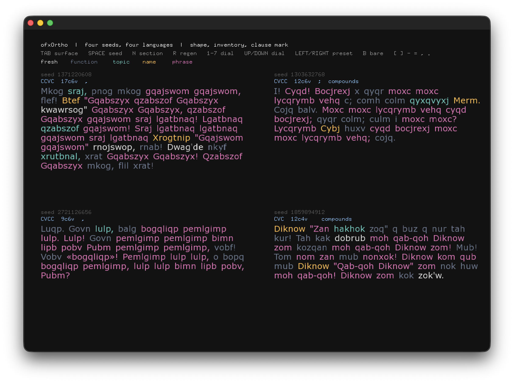

# ofxOrtho

[](https://github.com/leeMeredith/ofxOrtho/actions/workflows/conformance.yml)

openFrameworks addon for **ortho**, an invented-language generator — pseudo-words
that hold the shape and internal consistency of a language without belonging to
any existing one.

One instance mints a language substrate once from a seed (its own consonants,
vowels, digraphs, trigraphs, contractions), then every word comes from that same
invented tongue. Output holds together as one language rather than a fresh
scramble. Names recur, phrases return whole, things get quoted.

Same seed → same language, on every host and every run.



*Tokens coloured by origin: names, topics, and recurring phrases are
distinguishable from fresh coinages, on both the neutral and readable paths.*

## Install

```
cd openFrameworks/addons
git clone https://github.com/leeMeredith/ofxOrtho.git
```

Or use GitHub's *Download ZIP*. The language engine is vendored into
`libs/ortho-kernel/`, so both routes work with no extra steps.

Then generate a project with Project Generator and check **ofxOrtho**.

## Usage

```cpp
ofxOrtho ortho;

ortho.setup(12345);              // seed names the language
ortho.setPreset(0.5);            // one-knob onramp

auto words = ortho.tokens(100);  // vector<string>
```

Tokens carry their origin, which is useful for visual work — colour by source,
animate names differently, spawn on NAME:

```cpp
for (auto &t : ortho.tokensWithSource(100)) {
    switch (t.source) {
        case ORTHO_SRC_NAME:   /* section's identities */ break;
        case ORTHO_SRC_TOPIC:  /* section's subject    */ break;
        case ORTHO_SRC_PHRASE: /* recurring phrase     */ break;
    }
}
```

### The seven dials

Each takes a double in `[0,1]`, default 0. Frozen vocabulary — the same names
appear as JS options, Max attributes, and oF setters.

| setter | effect |
|---|---|
| `setPhrases()` | multi-word phrase recurrence, atomic |
| `setFunctionWords()` | grammar-glue recurrence, document scope |
| `setTopics()` | the section's subject recurring, section scope |
| `setNames()` | the section's identities recurring, section scope |
| `setCommas()` | narrative pacing (readable path only) |
| `setQuotation()` | direct-speech span (readable path only) |
| `setScareQuotes()` | a single term held at arm's length |

Explicit setters always win over `setPreset()`, regardless of call order:

```cpp
ortho.setTopics(0.9);
ortho.setPreset(0.3);    // topics stays at 0.9
```

With all seven at zero the engine reproduces the bare golden vectors exactly.

### Length arguments are ceilings, not targets

`maxLetters` and `maxWords` cap a random draw rather than setting it. Word
lengths vary below the value, which is deliberate — uniform lengths read as a
list rather than as prose.

`paragraph()` compounds this. It draws a per-sentence ceiling below your
`maxWords` and `maxLetters`, then `sentence()` draws each word below *that*. So
paragraphs come out markedly shorter than `tokens()` at the same settings —
around two or three letters per word at the default `maxLetters` of 8, short
enough that different seeds start to resemble one another.

If paragraphs read as too clipped, pass a much larger `maxLetters` — 20 or more
is reasonable. `tokens()` draws once and shows a language's character most
clearly.

This is reference behaviour, reproduced faithfully by the kernel. It is not
covered by the golden vectors, which exercise the token path only.

### Sections

`newSection()` mints a fresh cast of names, topics, and phrases. Same language,
new subjects.

### Reproducible or random, both

A seed names a language, so you get both surprise and recall:

```cpp
uint32_t seed = ofRandom(0, UINT32_MAX);
ortho.setup(seed);       // a language you've never seen
                         // keep the number and you can always return to it
```

## Surfaces

| call | returns |
|---|---|
| `tokens(n, maxLetters)` | exactly `n` words, no punctuation |
| `tokensWithSource(n, maxLetters)` | same, each carrying its origin |
| `sentence(numWords, maxLetters)` | capitalised, terminal mark, punctuation per dials |
| `paragraph(numSentences, ...)` | several sentences flattened |
| `word(numLetters)` | one word |

`tokens()` is count-exact and never punctuated — it is the harness contract and
the vector-diff path. `sentence()`/`paragraph()` are the readable path.

## Design rule

**The wrapper performs translation, not interpretation.**

Its only job is converting between `ortho_token[]` and C++ types, and exposing
the dials. Every public method maps to exactly one kernel concept. If this addon
starts making language decisions, something has gone wrong — that logic belongs
in the kernel, where every host shares it.

## Conformance

Coherence across hosts is *proven*, not hoped for:

```
./tests/conformance.sh ../ortho
```

```
CONFORMANT — 7/7 vectors, spec 1.1, vectors v2
```

The oracle drives this wrapper (not the kernel directly) and diffs its output
against the reference repo's golden vectors — identical text *and* identical
source classification. It builds standalone with plain `cc`/`c++`; no
openFrameworks required, because building GLFW proves nothing about language
conformance.

Run it from the addon root, with the [`ortho`](https://github.com/leeMeredith/ortho)
reference repo as a sibling directory. CI runs it on macOS and Linux on every
push — that is what the badge above reports.

## The constellation

- [`ortho`](https://github.com/leeMeredith/ortho) — JavaScript reference, `SPEC.md`, golden vectors. **The authority.**
- [`ortho-kernel`](https://github.com/leeMeredith/ortho-kernel) — the shared host-neutral C engine, vendored here at commit `2ba6491` (see [`libs/ortho-kernel/VENDORED.md`](libs/ortho-kernel/VENDORED.md))
- `ofxOrtho` (this repo) — openFrameworks addon
- `ortho-max` — Max/MSP external

When the spec and an implementation disagree, the spec wins and the
implementation is a bug.

## Platforms

**Tested:** openFrameworks 0.12.1 on macOS (Apple Silicon), Xcode clang.
C++11 or later.

**Untested but expected to work:** Linux, Windows, iOS, and other oF targets.
There is nothing platform-specific in this addon - the kernel is plain C99 with
zero dependencies and zero allocation, and the wrapper uses only the C++
standard library. No OS APIs, no threads, no file I/O, no third-party libraries.

If you build it somewhere I haven't, I'd welcome an issue or PR either way. The
conformance harness is the useful thing to run first, since it compiles with
plain cc/c++ and needs no openFrameworks. If it reports 7/7 on your platform,
the language layer is sound there and any remaining problem is in the oF build,
not the engine.

## Credit and licensing

Every part of the stack is MIT, and all of it is my own work:

- `ofxOrtho` (this addon) — MIT
- [`ortho-kernel`](https://github.com/leeMeredith/ortho-kernel) — the bundled C
  engine, vendored into `libs/ortho-kernel/` — MIT
- [`ortho`](https://github.com/leeMeredith/ortho) — the JavaScript reference and
  spec the above conform to — MIT

The addon has no third-party dependencies. The kernel is plain C99 with zero
dependencies and zero allocation; the wrapper adds only the C++ standard
library. Nothing beyond openFrameworks itself is pulled in.

## License

MIT — see [LICENSE](LICENSE).
